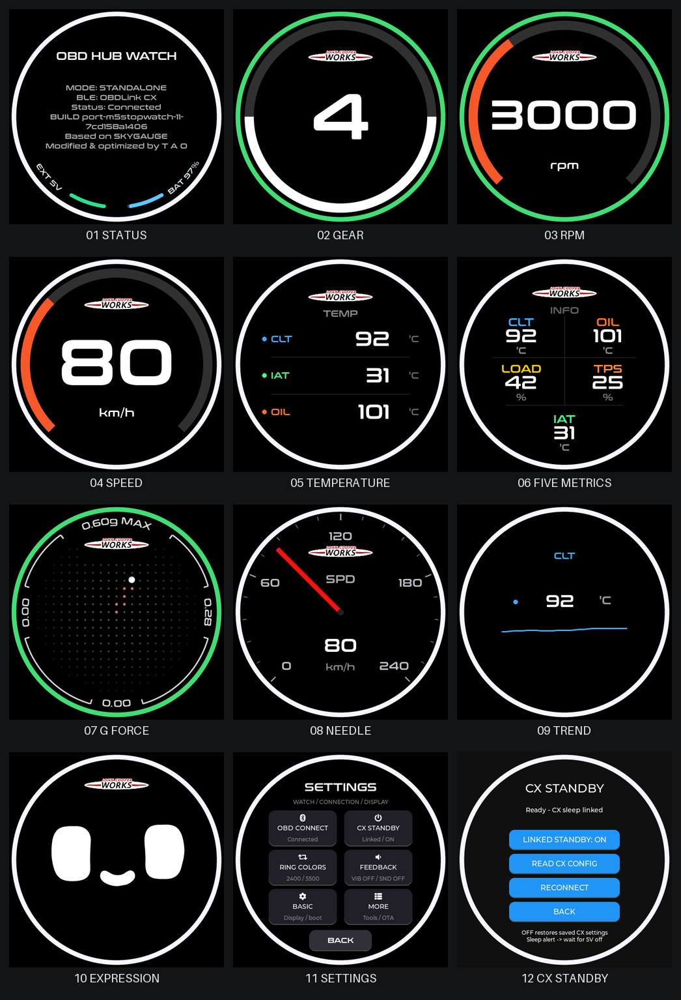
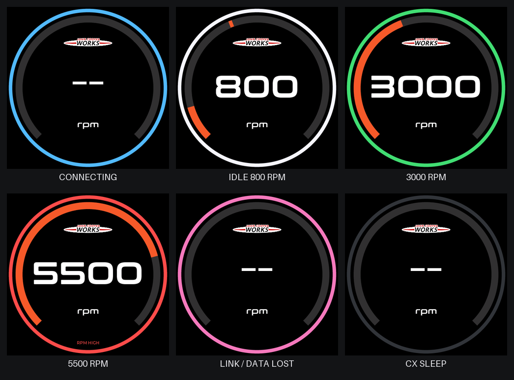

# OBD HUB WATCH

**Hardware standard / 硬件标准：M5Stack StopWatch C152 · V1.0**
**OBD adapter / 适配器：OBDLink CX · BLE · STN2310（测试固件 5.8.1）**

把 M5Stack StopWatch 改造成带电池、触摸与实体按键的圆形车载仪表。当前维护目标是 **StopWatch V1.0**，主要以 MINI JCW F56 8AT 的 OBD 实车测试为依据。

| 项目 | 当前标准 |
| --- | --- |
| 主控 / 存储 | ESP32-S3；16MB Flash；8MB PSRAM |
| 显示 / 触摸 | 1.75 英寸圆形 AMOLED；466×466 可见 UI；CO5300 / CST820 |
| IMU | BMI270；车辆安装方向校准后用于 G 表与表情页 |
| 电池 / 电源 | 内置 450mAh 电池；USB-C 或 V1.0 背面外部 5V 输入 |
| 软件 | ESP-IDF **5.5.4**、LVGL **8.4.0**、`sdkconfig.stopwatch` |
| 通信 | Watch ↔ BLE ↔ OBDLink CX ↔ 车辆 OBD 接口 |
| 维护者 | T A O / [cerary](https://github.com/cerary) |

> **版本区别：**本项目确认使用的是 **V1.0**。背面 EXT 14 脚可能印成 `BAT`，实际是 **5V IN**；11 脚是 GND。**V1.0.1 的 14 脚是电池端，不能照本项目接入 5V。**硬件版本请以实物和 [M5Stack 官方说明](https://docs.m5stack.com/zh_CN/core/StopWatch) 为准。无线接收模块应输出稳压 5V，详见[供电说明](docs/StopWatch-v1.0-无线供电.md)。

## 实际 UI 效果

以下展示默认主题的全部 10 个表盘及两页设置。图片由**本仓库的实际 LVGL 页面、字体、图片资源和圆环代码**在电脑上渲染。数值、连接、电池与 IMU 输入是固定示例；它们不是实车测量结果，也不是设备拍照或概念设计图。原尺寸单图均为 466×466。



| 页面 | 功能 | 原尺寸效果图 |
| --- | --- | --- |
| STATUS | 连接、构建、来源、电池与外部供电；弧形底部文字 | [状态](docs/images/status.png) |
| GEAR | 档位与档位进度圈；实际读取或按车型传动比估算 | [档位](docs/images/gear.png) |
| RPM | 转速、原报警与渐隐峰值标记 | [转速](docs/images/rpm.png) |
| SPEED | 车速与渐隐峰值标记 | [速度](docs/images/speed.png) |
| TEMP | 三个可选参数，默认 CLT / IAT / OIL | [温度](docs/images/temperature.png) |
| INFO | 五个可选参数，默认 CLT / OIL / LOAD / TPS / IAT | [五参数](docs/images/info.png) |
| G FORCE | 1.5G 满量程、方向 MAX、10 秒轨迹、零点校准 | [G 表](docs/images/g-force.png) |
| NEEDLE | 可选数据源的指针表 | [指针](docs/images/needle.png) |
| TREND | 可选数据源的趋势曲线；示例为 CLT | [趋势](docs/images/chart.png) |
| EXPRESSION | 同一组校准 IMU 数据驱动的动态表情 | [表情](docs/images/expression.png) |
| SETTINGS | 六宫格设置；详情保留原滚轮、滑条与开关 | [设置](docs/images/settings.png) |
| CX STANDBY | CX 配置回读、联动开关和恢复连接 | [CX 待机](docs/images/cx-standby.png) |

## 来源与许可

本项目在 [steveEcode/obd_brz_gauge](https://github.com/steveEcode/obd_brz_gauge) / **SKYGAUGE** 的基础上移植、改造和优化；该项目又源自 [zhaizhaitao/open_obd_dsp](https://github.com/zhaizhaitao/open_obd_dsp)。感谢两位上游作者。

本地 StopWatch 移植的共同上游基线是 [`528f54243ea1fe6f5e698291843ba3840e32efe5`](https://github.com/steveEcode/obd_brz_gauge/commit/528f54243ea1fe6f5e698291843ba3840e32efe5)，保留上游 Git 历史与 [GPL-3.0 LICENSE](LICENSE)。保留的上游功能不计为本项目原创。M5Stack 与 Bosch 库及 MINI 车标来源见 [第三方说明](THIRD_PARTY_NOTICES.md)。

设备状态页也显示：`Based on SKYGAUGE` / `Modified & optimized by T A O`。

已向上游提交：[AFR 选择重启丢失及默认报警阈值错误 #16](https://github.com/steveEcode/obd_brz_gauge/issues/16)，附原代码复现结果与脚本。

## 我们的改进

- **StopWatch 硬件移植：**屏幕、触摸、PMIC、双按键、BMI270、反馈；独立模式不启动 Wi-Fi / ESP-NOW；修复依赖头文件 ABI 不一致与 AMOLED DMA 分配失败路径。
- **OBDLink CX：**FFF1 通知 / FFF2 写入、订阅与配对时序、初始化、重连与日志；支持配置回读和按适配器保存原始省电参数。
- **数据有效性：**断联清空读数与覆盖值；按通道判断过期；缺失显示 `--`，保留真正的 0；过期车速不累积里程。
- **切页首帧：**数据页初始直接显示 `--`；进入页面时先读取当前有效缓存，避免先闪 `0/N` 或旧读数；真实零值与空档正常显示，开机扫表仍按原动画运行。
- **电源与待机：**接收 `LP ALERT` 后停止查询和重连；外部供电存在时保持工作，确认休眠且两路供电消失 3 秒后进入 PMIC 待机；USB、背面 5V 或电源键可唤醒。具体触发与兜底规则见[待机说明](docs/CX-待机测试.md)。
- **充电指示灯：**绿色状态灯按 PMIC GPIO2 的实际充电信号亮灭；电池供电、充满或充电信号未知时请求熄灭，兼容 USB 与 V1.0 背面 5V；保留原生启动 / 下载提示。新版已刷机，USB 充电时灯位开启回读通过，其余实灯变化待验收。
- **充电灯稳定确认（已刷机验证）：**充电芯片信号持续有效 5 秒才点亮，短暂变化不累计；充电结束、外部电源消失或状态未知时清除。USB 实测持续 5.243 秒后点亮，五次 1～3.5 秒变化未点灯；用户确认按键 / 切页后实灯保持熄灭。电池百分比不参与充电判断。
- **开机动画：**原生 466×466、30fps RGB565 连续像素压缩，兼容旧版动画格式；动画资源独立更新，Watch 可选择 VIDEO / OFF。设置与制作方式见[开机动画说明](docs/BOOT-ANIMATION.md)。
- **统一圆形 UI：**外圈距边缘 5px、宽 10px；与 RPM / 速度 / 档位灰圈间隔 10px，灰圈宽 20px；转速数字缩到橙色弧内。
- **指针表布局：**刻度盘外径 426px，外端距状态圈内沿约 5px；刻度数字使用 24 字号，主刻度 3×14px、小刻度 2×9px，分级提亮并留出数字间距；红针尖端距主刻度内端约 5px。
- **外圈状态提示：**跟随页面指标整圈渐变；连接中蓝色、断联或局部数据过期粉色、确认休眠或整页无数据变暗；外圈不随原转速报警闪烁。
- **峰值标记：**RPM / SPEED 的最高位保留 10px 标记，回落后 5 秒渐隐；更高值刷新；断联、过期、休眠和开机扫表不会留下假峰值。
- **G 表：**扩大点阵、方向 MAX 文字约 15px、折线端头 10px；接头裁剪避免越线；逐点轨迹约 10 秒淡出；沿用安装校准与 1.5G 满量程。
- **设置与导航：**状态页下滑进入六宫格；白色图标、原生控件、统一 BACK；触摸和按键循环一致，表情页在最后；OTA 集中到 MORE。
- **稳定性修复：**AFR 数据源重启保留与旧报警配置迁移、转速闪烁恢复原背景与页面所有者、CX 配置回复中行内 `>` 的正确处理、页面重建时释放画布内存。

详细的实现位置、行为与验证范围见 [改进清单](docs/IMPROVEMENTS.md)。



**已有上游功能仍保留：**车型配置、主题、ESP-NOW 多表、RaceChrono、OTA 等。它们在 StopWatch 的验证程度不同，不能据此推断已完成全车型 / 手机 App / 多表兼容测试。

## 使用与导航

默认主题的横向循环：

`STATUS → GEAR → RPM → SPEED → TEMP → INFO → G FORCE → NEEDLE → TREND → EXPRESSION → STATUS`

自定义主题附加页面位于 TREND 和 EXPRESSION 之间。黄色键上一页，蓝色键下一页；G 表蓝键双击清 MAX。安装后先在平地、静止状态校准 G 表；相同校准也供表情页使用，当前没有自动旋转显示方向。

状态页下滑 → SETTINGS：`OBD CONNECT`、`CX STANDBY`、`RING COLORS`、`FEEDBACK`、`BASIC`、`MORE`。车型和主题使用原滚轮，切换可能保存并重启。OTA 路径为 `MORE → FIRMWARE / OTA`。

开机动画路径：`MORE → MULTI-GAUGE → INTRO`。`VIDEO` 播放已安装动画，`OFF` 关闭；选择后下次启动生效。目前只有一个视频槽位，更新动画内容可单独上传资源包。

CLT=冷却液温度，IAT=进气温度，OIL=机油温度，LOAD=发动机负载，TPS=节气门开度，RPM=转速，SPD=车速，BAT=OBD 读取的车辆电压，OILP=油压，BKT=制动温度，BOOST=增压压力，AFR=空燃比。**是否有值取决于车型和 PID 支持；BAT 不是 Watch 电池百分比。**

MINI 当前走 OBD PID / 厂商请求轮询。OBD 接口可能具有 CAN 物理线，但不能假定其中包含所有内部总线广播；本车监听只观察到重复的 `0x130` 帧，尚未建立可替代 OBD 的有效 CAN 参数解码。上游 `ZN/C6 CAN` 是另一个车型的专用路径。

## 验证状态

| 项目 | 已有证据 | 尚待确认 |
| --- | --- | --- |
| OBD 读取 / 重连 | 此前实车已获得有效读数，短时断链能自动恢复 | 首次连接仍需更多重复测试；不能承诺所有车辆 |
| 本次固件 | ESP-IDF 构建、独立写入校验、35 秒启动日志通过；设置分区未变 | 新 UI 的用户实屏 / 实车验收正在进行 |
| UI 与逻辑 | 实际 LVGL 模拟、按键/手势循环、过期处理、峰值、画布释放和宿主回归通过 | 桌面模拟不能代替物理触摸与温升测试 |
| CX 省电 | 实车适配器回读已确认 ELM327 模式及 UART 空闲 300 秒；解析与状态机回归通过 | **真实 `LP ALERT`、熄火整条待机链尚待测试** |
| V1.0 背面供电 | 原理图核对、两路检测与唤醒配置回读通过 | **无线接收模块、背面断电与重新供电唤醒尚待安装测试** |
| 充电指示灯 | 500ms 全页面检测；构建、写入校验和 35 秒启动通过；USB 充电灯位开启回读通过 | **USB 拔线、充满、关机及背面 5V 的实灯变化待确认** |

`800 rpm / 0 km/h` 是怠速，继续工作。持续有新数据的 `0 rpm / 0 km/h` 也不会仅凭两个零值立即关机。待机条件和 BLE 断联分开处理，见[具体状态机](docs/CX-待机测试.md)。

## 编译与烧录

安装 ESP-IDF **5.5.4**，在其 PowerShell 环境中执行：

```powershell
git clone https://github.com/cerary/OBD-HUB-WATCH.git
cd OBD-HUB-WATCH
.\tools\prepare_stopwatch_deps.ps1
$env:STOPWATCH_DEPS_DIR = (Split-Path (Get-Location).Path -Parent)
idf.py -B build-stopwatch '-DSDKCONFIG=sdkconfig.stopwatch' build
```

脚本准备固定版本 M5GFX 0.2.19、M5PM1 1.0.6、M5IOE1 1.0.8 和 Bosch BMI270 SensorAPI，并应用两处驱动兼容 / DMA 修复。依赖放在仓库的兄弟目录；`managed_components` 由 IDF Component Manager 管理。详情见 [BUILD.md](docs/BUILD.md)。

首次安装先确认是 V1.0，再按当前分区表烧录：

```powershell
idf.py -B build-stopwatch '-DSDKCONFIG=sdkconfig.stopwatch' -p COMx flash monitor
```

项目名为 `obd_hub_watch`，应用文件为 `build-stopwatch/obd_hub_watch.bin`。3MB `ota_0` 位于 `0x20000`，`ota_1` 位于 `0x320000`。已有设备仅更新应用时，先确认实际活动分区和分区表一致，再使用对应偏移；不要把一个固定偏移套用于任意 OTA 状态。

[固件目录](firmware/README.md)记录当前已刷镜像与 SHA-256。它是应用包，不能拿来替代一块空白设备的完整首刷。当前版本不支持将 V1.0 固件直接视为 V1.0.1 的供电验证版。

## 开发与检查

自动检查：[宿主回归](https://github.com/cerary/OBD-HUB-WATCH/actions/workflows/host-checks.yml) · [StopWatch V1.0 完整编译](https://github.com/cerary/OBD-HUB-WATCH/actions/workflows/firmware-build.yml)。

```bash
python3 tools/test_host.py
# 已通过 ESP-IDF 准备 managed_components 后，在 Linux / WSL 使用 gcc 渲染实际 UI：
python3 tools/ui_preview/render.py --output docs/images
python3 -m pip install Pillow
python3 tools/ui_preview/assemble.py --output docs/images
```

`test_host.py` 检查实际策略、缓存和 NVS 代码；硬件与传输用宿主桩替代。PNG 合图只添加图外标题，不重新绘制表盘。图片生成信息与源文件校验见 `docs/images/sim-manifest.json`。

| 目录 | 内容 |
| --- | --- |
| `main/stopwatch/` | StopWatch 外设、电源、IMU 与按键适配 |
| `main/bsp_obd_dsp/` | BLE / ELM327、CX 状态机、NVS |
| `main/app_obd_dsp/` | 缓存、车型、外圈与峰值策略 |
| `main/export_path/` | LVGL 页面、字体、图标与渲染 |
| `tools/` | 固定依赖、策略检查、UI 渲染与构建辅助 |
| `docs/` | 当前功能、供电、待机与构建说明；`upstream/` 是历史资料 |
| `firmware/` | 本硬件当前应用镜像与校验 |
| `android_app/`、`theme_store/`、`themes/`、`model/` | 保留的上游 App / 主题 / 机械模型，详见上游文档 |

## English overview

**OBD HUB WATCH targets M5Stack StopWatch C152 hardware V1.0**, using ESP-IDF 5.5.4 and LVGL 8.4.0. It connects to OBDLink CX over BLE, adds calibrated BMI270 G-force and expression pages, and improves data freshness, power handling and the round UI. It derives from **steveEcode/obd_brz_gauge (SKYGAUGE)** and **zhaizhaitao/open_obd_dsp**, retaining GPL-3.0 and upstream history.

The gallery is rendered from actual production UI code with illustrative inputs, not vehicle measurements. Real-car LP ALERT delivery and rear wireless-5V sleep/wake validation remain pending. **V1.0 rear pin 14 is 5V input; V1.0.1 pin 14 is a battery pin and must not receive 5V using this wiring.** See [build instructions](docs/BUILD.md), [improvements](docs/IMPROVEMENTS.md) and [firmware manifest](firmware/stopwatch/manifest.json).
