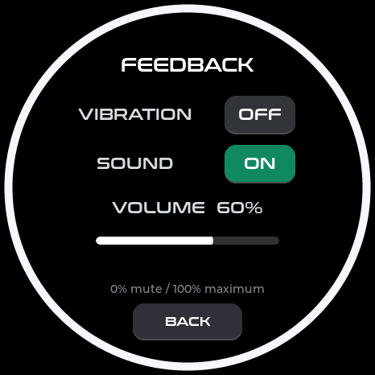

# StopWatch 操作提示音

硬件：**M5Stack StopWatch C152 V1.0**。路径：状态页下滑 → `FEEDBACK → SOUND`。
这是操作提示音，不是语音播报；SOUND 开关保存在原有 NVS 设置中。
新增 `VOLUME` 滑条：0–100%，未设置时默认 60%；100% 等于已经听音确认的响度，0% 静音。
拖动只显示百分比，松手或触控失去捕获后保存，并在 SOUND 开启且音量非零时试听一次。
关闭 SOUND 时滑条变暗且不可拖动，保留上次音量。保存失败会恢复原数值并显示 `SAVE FAILED`。
音量用独立 `cfg/soundvol` 键保存，不改变既有车辆 / IMU / CX 配置布局，也不在每个拖动事件写 Flash。

*466×466 实际 LVGL/UI 代码渲染，图中配置为示例值。*

## 当前实现

- 44.1kHz / 16bit / 双声道，左右发送相同的 1600Hz 提示音；不启用麦克风。
- 时长 80ms，起止各约 3ms 渐入 / 渐出；codec 固定音量 100，PCM 按用户百分比缩放，最大峰值 18000（满量程 32767）。
- AW8737A 典型启动时间为 40ms；当前功放启动等待 50ms；音调之后发送 1280 帧静音，超过 4×256 帧 DMA 总容量，再关闭功放。
- DMA 缺数据时自动清零，避免重复播放旧音调；中断统计已发送的非零 DMA 缓冲。
- 回读音频供电、功放、codec 时钟 / 电源 / 静音 / 音量；错误日志指明失败阶段。
- 初始化或写入失败后释放资源，5 秒后允许重试；声音在反馈任务中处理，振动脉冲保持独立。

原实现有两项明确问题：音量 18 在默认曲线上约为 -41dB；PCM 写入后立即关功放，
而 `i2s_channel_write()` 返回只表示已复制到 DMA，不能表示播放完成。
原功放只预等待 8ms，短音开始时尚未满足 AW8737A 的典型 40ms 启动时间。
原来的初始化失败后也不重试，音频写入错误没有日志。
本次同时调整了音频格式、时长、音量和功放时序；没有单独验证其中某一项是否足以解决原先的无声问题。

## 实物验证

首轮 40ms / 音量 60 版本仍无声，虽记录了 25 次写入成功。
第二轮 80ms / 双声道 / 音量 80 版本记录了 19 次提示音，每次实际发送 14 个非零 DMA 缓冲；
codec 和供电回读正常，没有音频错误或崩溃。用户确认 **开启有声、关闭无声**，但声音偏小。

第三轮仍为 660Hz，提高到音量 95 / PCM 9000 后，用户反馈响度仍不足。
第四轮改用 1600Hz、音量 100 / PCM 18000，用户确认“响度不错，很大声，可以使用”。
本次在该响度上增加音量滑条。配置回归、生产 LVGL 渲染和刷机启动验证通过；用户已确认音量可正常调节，0% 静音、降低音量及 100% 响度正常。操作日志记录 23 次提示音，幅度随百分比变化，功放关闭回读均通过且无音频错误；随后从 NVS 读出的最后选择为 10%，硬件重启后仍加载 10%。
数字发送成功、寄存器回读通过和实际听到声音分别记录，不能互相替代。
设备备份和原始日志保留在本地 `outputs/audio-fix-20261002*`，不发布。

## 硬件与实现依据

实现：`main/stopwatch/stopwatch_board.cpp`。
[M5Stack 音频定义](https://docs.m5stack.com/en/core/StopWatch#Audio)：ES8311、AW8737A、8Ω / 1W 扬声器，
I2C G47/G48，I2S G18/G17/G15/G21，PYG3 控制音频供电。
官方 `M5StopWatch-UserDemo` 的 `hal_ioe.cpp` 同时设置 PYG10 和 ESP GPIO14 使能。
DMA 缓冲语义参见 [ESP-IDF 5.5.4 I2S 文档](https://docs.espressif.com/projects/esp-idf/en/v5.5.4/esp32s3/api-reference/peripherals/i2s.html)。

功放依据：[AW8737A 官方数据手册](https://doc.awinic.com/doc/20230609wm/ba30d80d-55b2-46f8-8f8a-505cd74a8826.pdf)，
典型启动时间 40ms；增益为 319.5kΩ / (Rin + 16.6kΩ)。按
[官方参考原理图](https://m5stack-doc.oss-cn-shenzhen.aliyuncs.com/1242/C152-SCH_Stopwatch_PRJ_Main_VA_20251201_2026_04_24_17_46_22.pdf)
R57 / R58 的 200kΩ 计算，电压增益约 1.48 倍。这是参考图计算，尚未实测板上电阻及声压。
官方示例按键音约 1865 / 2093Hz，报警音 1760Hz；当前 1600Hz 用于提高短提示音的辨识度，最终以听音验收为准。
