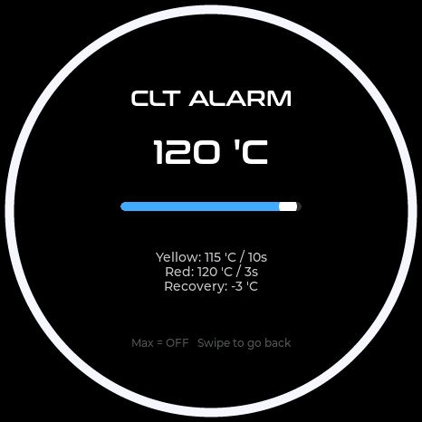
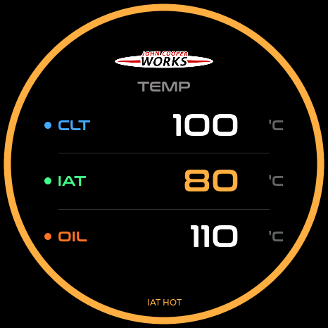

# StopWatch 温度提醒

适用硬件：M5Stack StopWatch C152 V1.0；当前初始阈值针对原厂 2021 MINI JCW F56 的日常观察。
这些是用户自定义预警值，不是 MINI 公布的 ECU 保护限值，不代替原车 Check Control 提示。
[2021 MINI 官方手册第 136–137 页](https://www.miniusa.com/content/dam/mini/PDF/archiveownermanuals/MY21/2021_HARDTOP_2_DOOR.pdf)确认水温、油温过高会报警，但未公布具体门槛。

| 参数 | 黄色预警 | 高级提示 | 恢复温差 |
| --- | --- | --- | --- |
| CLT 冷却液 | 115°C / 10 秒 | 120°C / 3 秒，红色 | 3°C |
| IAT 进气 | 60°C / 30 秒 | 80°C / 10 秒，橙色 | 5°C |
| OIL 机油 | 125°C / 10 秒 | 135°C / 3 秒，红色 | 5°C |

持续时间指至少覆盖该时间的一系列有效采样；必须有后续新采样确认，不能靠重复绘制同一缓存值触发。
慢速温度通道可能在下一次采样到达时才确认。低于触发温度会中断尚未完成的计时。
CLT 从红色降至 117°C 恢复黄色，再降至 112°C 恢复正常；OIL 分别为 130°C / 120°C，IAT 为 75°C / 55°C。

CLT/OIL 的已确认高温在各实时表盘优先显示红色外圈和 `CLT HIGH` / `OIL HIGH`。
黄色阶段也可跨表盘显示 `CLT WARM` / `OIL WARM`，但已有转速或 G 值红色报警优先。
IAT 仅在包含该参数的页面提示 `IAT WARM` / `IAT HOT`，不作为全局发动机过热报警。
所有数值页使用同一份已确认状态，数字颜色与外圈一致；外圈和提示不闪烁，不增加声音或震动。
设置页不覆盖温度警告，后台继续计时，返回实时表盘后显示当前状态。
断联、CX 休眠、通道超过 15 秒没有更新、无效数据、演示模式和开机扫表均清除温度状态及计时。

## 调整阈值

在趋势曲线页选择 CLT / IAT / OIL，向上滑进入对应的 ALARM 设置。
沿用原滑动条：设置高级提示温度，黄色温度自动分别减去 5 / 20 / 10°C；页面同时显示两级持续时间和恢复温差。
滑至最右侧 OFF 同时关闭该通道两级提示。更改设置会重新开始确认计时。

以下由本仓库实际 LVGL/UI 代码渲染，数值为模拟输入，非实车测量：

首次升级只将原先关闭的三个温度通道启用为上述默认值，已有自定义门槛及其他参数报警保持不变。
通过独立 `tempalert_v1` 标记记录升级：之后主动选 OFF，重启仍为 OFF。
蓝牙绑定、CX 休眠配置、其他设置与 JCW 开机媒体不由此功能改变。

热车后 CLT 约 90–110°C、OIL 约 90–120°C 可作初始观察参考，仍需结合本车气温、负荷和日志校准。
IAT 受环境温度、增压和怠速积热影响，不应直接套用水温/油温的过热判断。
