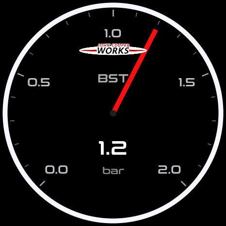

# 2021 MINI JCW F56 8AT：读数、单位与显示量程

适用车辆：原厂动力的 2021 MINI John Cooper Works F56、B48 2.0T、8AT。
量程决定指针、圆弧和曲线的显示比例，不等于发动机限制或安全报警阈值。
数字读数继续显示收到的有效数据，超出量程时仅图形到达端点。

## 已核对的原厂参数

[MINI 官方 2021 年 3 月技术规格](https://www.press.bmwgroup.com/global/article/attachment/T0325441EN/471413)列出：

- 排量 1998 cc，最大功率 170 kW / 231 hp，功率区间 5200–6200 rpm。
- 最大扭矩 320 Nm，扭矩区间 1450–4800 rpm。
- 8AT 版本最高车速 246 km/h，0–100 km/h 为 6.1 秒。
- 8 个前进档；终传比 2.955，齿比分别为 5.519 / 3.184 / 2.050 / 1.492 / 1.235 / 1.000 / 0.801 / 0.673，与当前车型配置相符。

规格表未列出断油转速和最大增压压力。6200 rpm 是最大功率区间的上端，不能当作断油点。
原厂增压也不能仅凭“约 2 bar”设为已确认的上限。

## 本次统一的显示范围

| 参数 | 含义 | 显示量程 | 处理 |
| --- | --- | --- | --- |
| RPM | 发动机转速 | 0–7000 rpm | 原 8000 改为 7000；覆盖已确认功率区间并留余量 |
| SPD | ECU 车速 | 0–280 km/h | 原 240 改为 280；覆盖原厂 246，指针主刻度 0 / 70 / 140 / 210 / 280 |
| BST | 歧管增压表压 | 0–2.0 bar | 数值、刻度、曲线、报警设置统一换算；主刻度 0.0 / 0.5 / 1.0 / 1.5 / 2.0 |
| CLT | 冷却液温度 | −20–130 °C | 保留显示范围；不据此认定 130 °C 安全 |
| IAT | 进气温度 | −20–100 °C | 保留 |
| OIL | 发动机机油温度 | −20–160 °C | 保留；当前缓存只接受 −20–150 °C，量程不等于数据有效范围 |
| LOD | ECU 计算的发动机负荷 | 0–100% | 保留；不等于扭矩百分比 |
| TPS | 节气门位置 | 0–100% | 保留；不等于油门踏板位置 |
| BAT | CX / OBD 端测得的车辆电压 | 8–16 V | 保留；与 Watch 电池百分比不同 |
| OIP | 机油压力 | 0–10.0 bar | 保留通用范围；当前 JCW 未配置专用压力 DID |
| BKT | 刹车温度 | 0–800 °C | 保留外部传感器用途；当前 Watch 无独立刹车温度传感器 |
| AFR | 空燃比 | 8.0–22.0 : 1 | 保留；项目按 Lambda × 14.7 换算，非所有燃料的实际化学计量比 |
| G FORCE | 校准后的纵向 / 横向加速度 | 1.5 G 满量程 | 与动力参数无关，保留 |
| GEAR | 当前前进档估算 | 1–8 | 齿比配置已与官方一致；静止 N 不代表直接读取到 P/N 选择器状态 |

RPM / SPD 的车型量程由 `vehicle_profile_t` 的两个显示字段提供；其他车型继续使用原来的通用范围。
圆弧、指针、趋势、扫表和最高值标记使用同一组范围。转速报警设置也采用车型量程；既有较高的自定义阈值继续保留，不重置用户阈值。
温度和五参数页共享同一读数与单位转换，缺失 / 过期仍显示 `--`。
外部传感器或车辆未提供的数据，不因可以选择该参数就认为已经可读。

## BST 为什么以前写 20

内部缓存用 0.1 bar 整数：`12` 表示 `1.2 bar`，`20` 表示 `2.0 bar`。
旧版中心数字已换算，但指针刻度和 BST 报警标签直接显示整数，造成单位不一致；本次统一修正。
指针内部仍按原始精度定位，电压 14.4 V、AFR 14.7 等也不再先取整再定位。

实际 LVGL 模拟示例：1.2 bar 读数，五个主刻度按 bar 显示（非实车测量）。



当前 JCW 查询的是标准 `01 0B` 歧管绝对压力，换算为：

```
BST = max(0, MAP_kPa − 100) / 100 bar
```

代码以固定 100 kPa 为大气压参考，并保留到 0.1 bar（截断）；未读取实时大气压。
例如约 2.0 bar **绝压**，在这个参考下约为 1.0 bar **增压表压**。
如果指的是 2.0 bar 增压表压，则对应约 3.0 bar 绝压，两者不可混用。

当前解析只读取一个字节，最大 255 kPa，即 2.55 bar 绝压；减参考值后为 1.55 bar，现有显示精度下最多 1.5 bar。
所以 2.0 bar 是仪表显示余量，不能证明当前数据源能测到 2.0 bar 表压，也不能证明原厂最大增压是多少。
确认更高增压需有车辆支持的扩展压力数据或独立传感器；本次没有添加未经验证的 BMW DID。

## 验证与边界

主机模拟运行实际 LVGL、车型表和 UI 代码，检查：246 km/h 的圆弧比例、7000 rpm 端点、
BST 的五个小数刻度、1.2 / 1.5 bar 报警阈值保存、曲线原始单位、14.4 V / AFR 14.7 指针精度、
断联占位和扫表。模拟输入用于验证显示逻辑，不是实车测量。

实车的最大压力、断油转速和温度报警点仍需与实际 ECU / 车辆资料核对。
